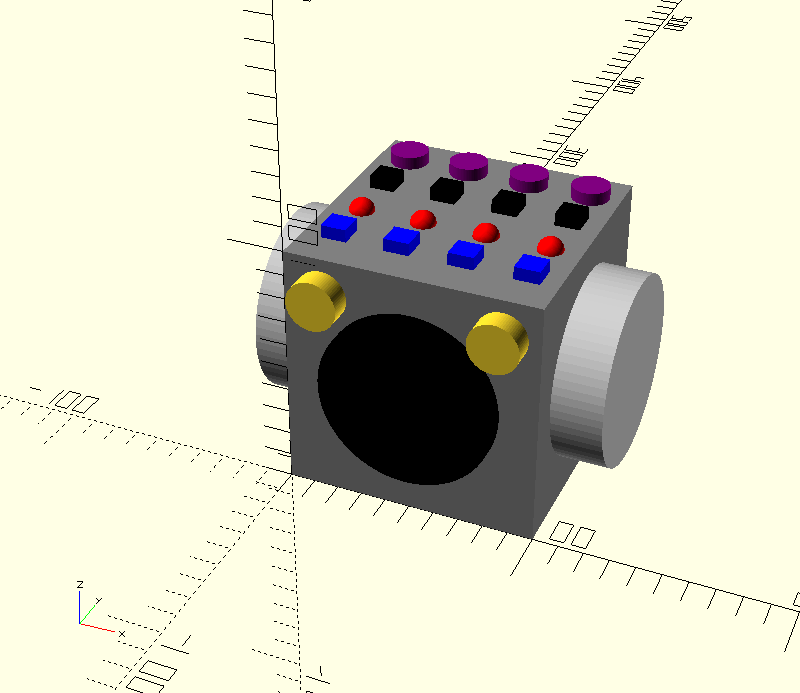

# Baby's First 8

Analog sequencer + synthesizer disguised as a child's "busy board".

## About

A few weeks ago I watched a documentary about the [Roland TR-808](https://en.wikipedia.org/wiki/Roland_TR-808) and it got me interested in analog sequencers.  These machines fascinated me because they are actually analog/digital "chimeras"; using digital logic to control analog signals.  I decided I wanted to build one of my own design and after a little bit of reading and some conversations with musicians who use them, I figured out what I would need to put something together.

Around the same time, I noticed that these machines had something in common with another "maker project" I've considered; building a child's ["busy board"](https://www.etsy.com/market/busy_board).  These are boards (or boxes) covered in buttons, switches, lights and other mechanical bits designed to entertain children.  The controls on busy boards I've seen serve no specific purpose (they are just fun to play with) but after noticing the simularity between these and analog sequencers/synthesizers I came up with the idea to combine them, and "Baby's First 8" was born.

The idea is to create a childproof box of controls that is fun to play with but also happens to be functioning sequencer + synthesizer.  Minimally this becomes a slightly unusual busy board, but it may also teach children how to compose electronic music as a side-effect.  

## Why "Baby's First 8"?

The name is derived from the name of a DIY sequencer named ["Baby 8"](https://www.etsy.com/listing/468917092/baby-8-step-sequencer-electronic-project), which is in turn a derivative of the ["Baby 10"](http://www.midiwall.com/gear/babyseq/).  Ironically, my current design for *Baby's First 8* has only 4 steps, but the name is so fun that I don't want to change it (maybe I'll find an aesthetic way to cram 4 more steps in there, or make expansion a standard feature).

# Design

## Electronics

BF8's electronics consist of four stages:

1. Clock
2. Counter
3. Synthesizer
4. Amplifier

Clock pulses are supplied by a 555 timer.  The clock drives a 4017 decade counter whose outputs are switched and attenuated before being connected to the synthesizer.  The synthesizer stage is another 555 timer used to generate a square wave[^1].  The output of the synthesizer is fed into an LM386[^2]-based amplifier stage which terminates in a small speaker.

## Controls

Two large knobs on the side of the box are used to control the speed of the sequencer and the volume level.  The volume knob also has switch to turn the box on and off.  There should be a way to start/stop the sequence, but I haven't decided on a good place to put that yet.

Each step contains a collection of identical controls:

* Trigger
* Triggered indicator
* In/out
* Level (*"vc"*)

The trigger button simulates the actuation of a step, this can be used to tune the level/vc setting.  The triggered indicator lights when the step is turned on by the sequencer (i.e., the note is played).  The in/out switch enables or disables a step and the level knob sets the voltage fed to the synthesizer when the step is triggered.

Additional controls may be added to modify the behavior of the synthesizer stage.  The simple 555 square wave generator can be controlled exclusively by setting the level knob on each sequencer step, but if a more flexible synthesizer stage is employed there may be more options.

## Input/Output

Output is primarilly through an internal speaker.  Additionally headphone or line-out jacks may be added (if they can be safely).  In addition to signal-out, jacks may be added to allow one BF8 to be connected to another to add more steps to the sequencer, create a "stereo pair" or support multiple, syncronized voices.  

These options may create too much complexity or result in design challenges (how do you keep crayons from being jammed into 1/4" jacks?) but it would be cool to allow for expandability/hackability somehow.

[^1]
Or something slightly more sophisticated, but nothing too exotic/complex/etc.

[^2]
Perhaps something more modern/efficient like a PAM8302 could be used if a suitable part can be had.
